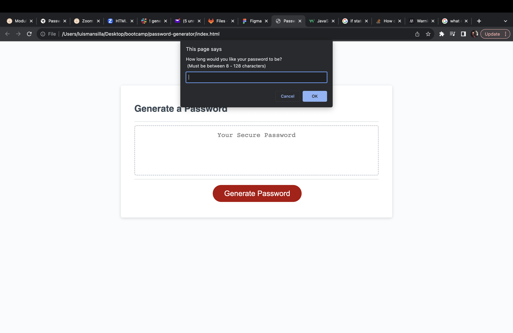
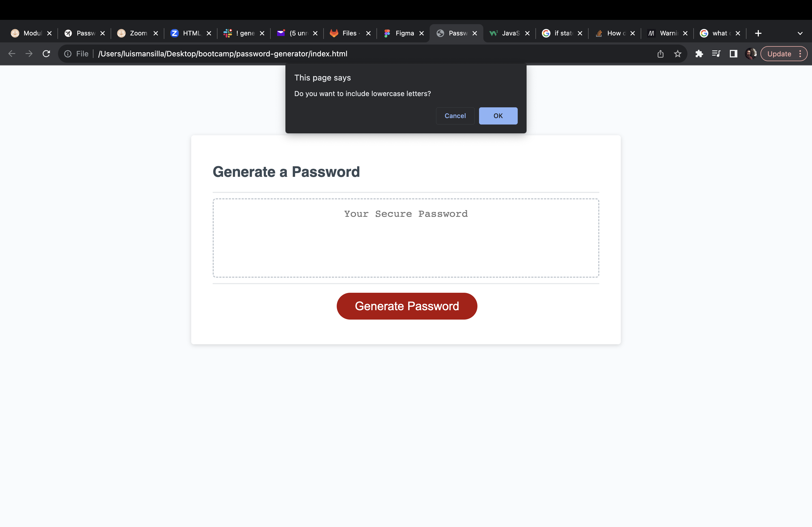
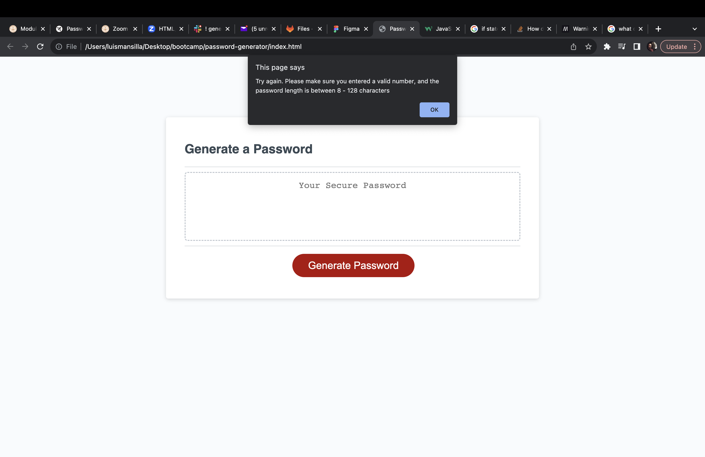
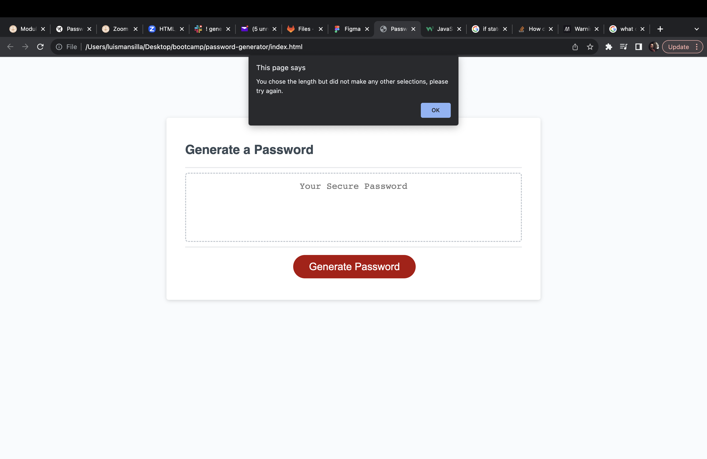
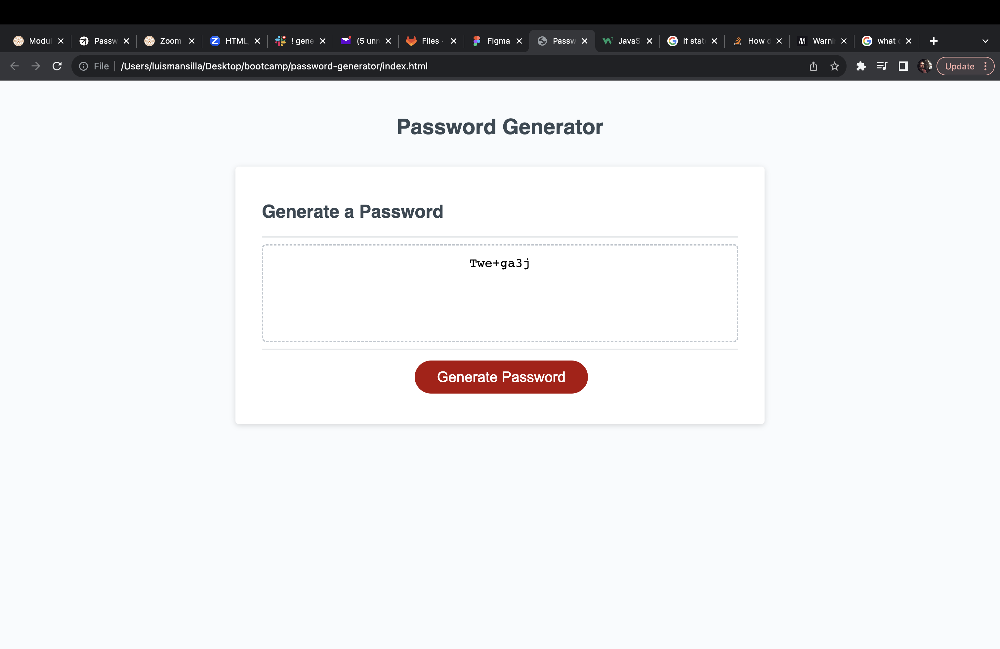

# Password Generator

## Repository

In this repository you will find the application code to a password generator. The purpose of this application is to generate a password based on criteria selected by the user. The password is generated using JavaScript by selecting HTML elements and adding user interaction. The two major things selected are the Generate Password button and the Text Area that displays the new password. Arrays are declared at the start of the script file to provide the characters avaiable to the user. The basic functionality of this application is as follows: 

- The user clicks on the Generate Password Button
- A series of prompts allow the user to decide the password criteria including length, and characters being used
- As the user is making decisions, an empty array is updated after every prompt to include specific characters in the password
- A random index number is generated using Math.floor and Math.random methods to randomly select characters based on the user password criteria 
- A new generated password is now returned and stored in a randomPassword variable
- The new password is then displayed in the text area box using querySelector to grab the text area and change its value to include the characters generated randomly 

In the process of writing this code, I constantly used the Chrome dev tools to periodically run my code to catch any errors before continuing to the next function. The debugger helped me understand what was happening as the code ran. An important thing I learned is that the code jumps around the script based on the function being called. Although the script is read from top to bottom, the functions dictate what section of the code is currently running. There is a main function that runs called writePassword which triggers other functions while assigning variables to generate the password step by step. In the future I would like to implement a way to store the password generated based on what the password is for.

## Table of Contents

- [Contribute](#contribute)
- [Appearance](#appearance)
- [Changes](#changes)
- [Features](#features)
- [Credits](#credits)
- [License](#license)

## Contribute

To view the repository of this password generator and contribute to this application click the following link:  [Password Generator](https://github.com/lmansilla92/password-generator)

If you need help on how to clone a GitHub repository into your local repository, visit the following GitHub link: [Cloning a repository](https://docs.github.com/en/repositories/creating-and-managing-repositories/cloning-a-repository) 

## Appearance

When you first open the deployed webpage the first thing you will see is the text area with place holder text and the Generate Password button:
    

When you click on the button the first prompt asking for password length appears.
    

A window pops up that confirms the type of characters being used. This is followed by uppercase, numbers, and special character confirmations:
    

If the user does not enter a valid number or stay within the allowed password range, the following alert is triggered:
    

This alert appears if a password length within range is selected but the user does not select any other password criteria resulting in an empty character array to choose from:
    

If the user successfully picks the password criteria without triggering any alerts, the page will display the new generated password in the text area box:
        

To view the deployed webpage click the following link: [Deployed Webpage](https://lmansilla92.github.io/password-generator/)

## Changes

I would like to make the following changes to add features to this password generator:

- Allow the generated passwords to be stored somewhere
- Sort passwords by login information
- Include some animation when a password is successfully generated

## Features

This application features prompts for user input and alerts. Another method used is confirm() to return true/false when password criteria is selected.

## Credits

Link to the starter code repository: [Starter Code](https://github.com/coding-boot-camp/friendly-parakeet)

## License

Link to [The MIT License (MIT)](https://github.com/lmansilla92/password-generator/blob/main/LICENSE)